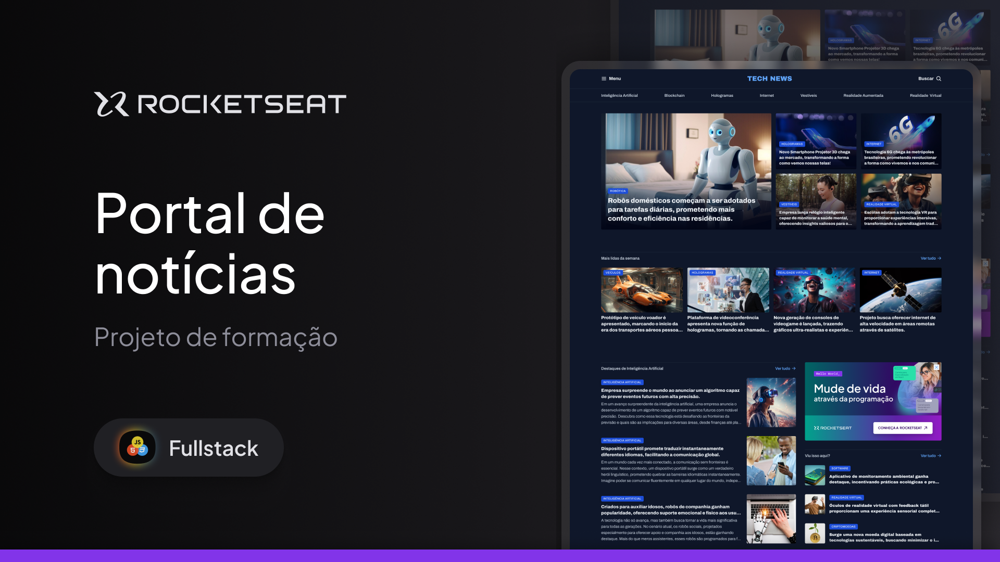

### 🌏 Portal de notícias

Este projeto é uma página web construído com HTML e CSS que simula um portal de notícias focado em tecnologia. A interface apresenta notícias destacadas, categorias temáticas, destaques semanais e artigos sobre Inteligência Artificial e outros temas inovadores.

Este é um projeto **estático** com **apenas uma página** e não possui funcionalidades dinâmicas.

**Projeto desenvolvido como exercício de HTML e CSS com foco no uso do GRID, baseado em aula da [Rocketseat](https://www.rocketseat.com.br).**

--

## 🖼️ Prévia do Projeto

---

### 📋 Sobre o projeto

A página apresenta as seguintes seções:

- **Cabeçalho com menu principal e categorias temáticas**
- **Seção de destaque com imagem principal e manchete**
- **Grade com notícias secundárias e etiquetas de categoria**
- **Seção “Mais lidas da semana” com chamadas de artigos**
- **Sessão de Inteligência Artificial com textos explicativos**
- **Bloco lateral com sugestões extras e propagandas**

---

### 🛠️ Tecnologias Utilizadas

- **HTML5**
- **CSS3**

---

### 📌 Melhorias futuras

- Criar versão para dispositivos móveis com Media Queries
- Adicionar interatividade com JavaScript
- Integrar com uma API de conteúdo para tornar o portal dinâmico
- Criar páginas internas para cada artigo

---

### 👨‍💻 Autor

Desenvolvido por Wigor.  
Projeto fictício com fins educacionais.
